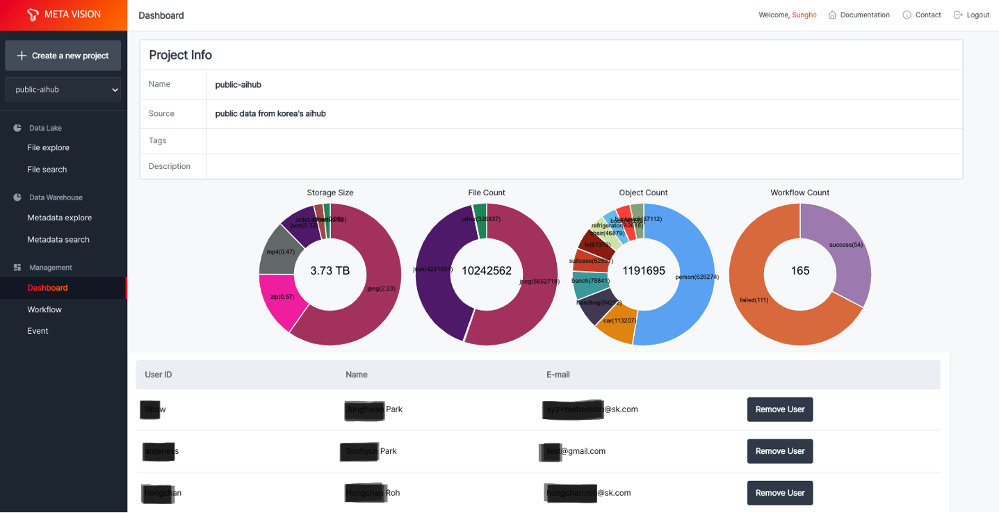

# Dashboard

<b>Dashboard</b>에서는 프로젝트 정보, 보유한 데이터 현황 그리고 데이터를 공유할 사용자 정보를 제공합니다.

제공하는 차트는 다음과 같습니다.

- Storage Size: object storage에 저장된 파일에 대해 유형별 총 사이즈
- File Count: object storage에 저장된 파일에 대해 유형별 총 개수
- Object Count: ML Workflow로 추출된 메타 정보에 대해 유형별 총 개수
- Workflow Count: 등록된 Workflow의 진행 현황

각 프로젝트별로 사용자 추가 및 삭제를 통해 데이터를 공유할 수 있다.

