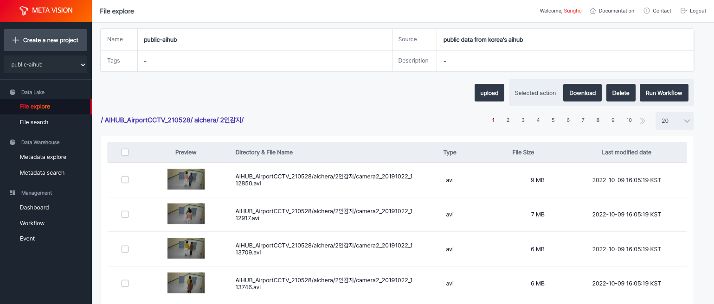
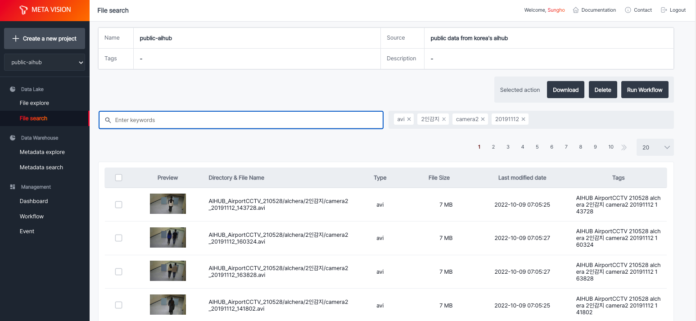
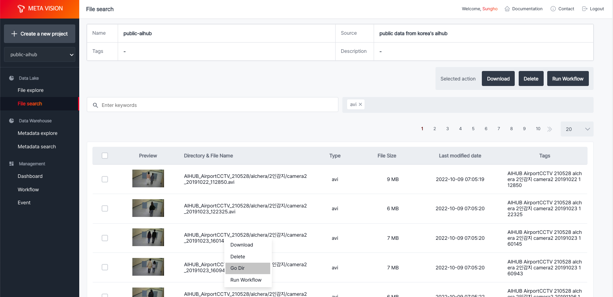

# File explore

<b>File explore</b>는 object storage에 저장된 파일들을 File browser 형태로 볼 수 있도록 환경을 제공합니다. 

Object storage는 구조화되지 않은 대량의 데이터를 처리하도록 설계된 data storage architecture입니다. 

Object storage의 파일들은 파일 자체와 메타 정보를 가지고 있는 객체(object) 형태로 관리되고 있으며, 수평 확장이 가능하여 확장성에 제한이 거의 없어 대용량의 데이터를 저장하고 메타 정보를 활용하여 쉽게 검색 및 활용할 수 있습니다.

사진과 동영상 파일의 경우, 미리보기를 제공하고 있어 실시간으로 데이터를 확인할 수 있습니다.

모든 데이터는 프로젝트별로 접근 권한 관리가 되고 있으며, 사용자는 권한이 있는 프로젝트에서만 데이터를 업로드 및 다운로드를 할 수 있습니다.

<b>< File explore 조회 ></b>

# File search

File explore의 경우, 직접 object storage에 데이터를 순차적으로 조회하여 결과를 받는 방식을 사용하여 대용량의 데이터가 있는 경우 수행 시간이 지연될 수 있습니다.

<b>File search</b>는 object storage에 업로드된 모든 데이터에 대해 메타 정보를 별도로 저장하여 파일 경로, 파일 이름뿐만 아니라 문자 기반 파일의 경우 문서 내 키워드도 태그로 저장하여 <b>키워드 기반 검색</b>을 실시간으로 제공하고 있습니다.

<b>< File search 조회 ></b>

이를 기반으로 원하는 데이터를 태그 기반으로 쉽게 찾을 수 있으며, 찾은 데이터가 있는 위치로 이동하여 관련 데이터를 전체 확인할 수 있는 기능을 제공하고 있습니다.

<b>< 검색한 파일이 있는 Directory로 이동 ></b>
