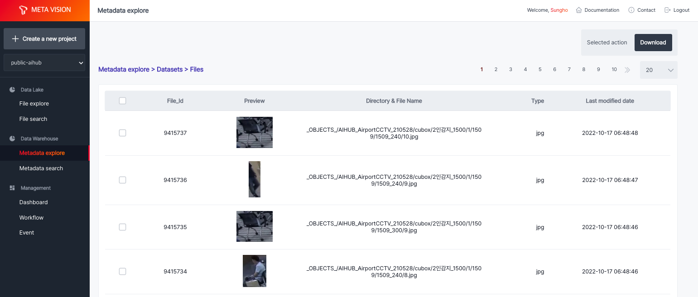
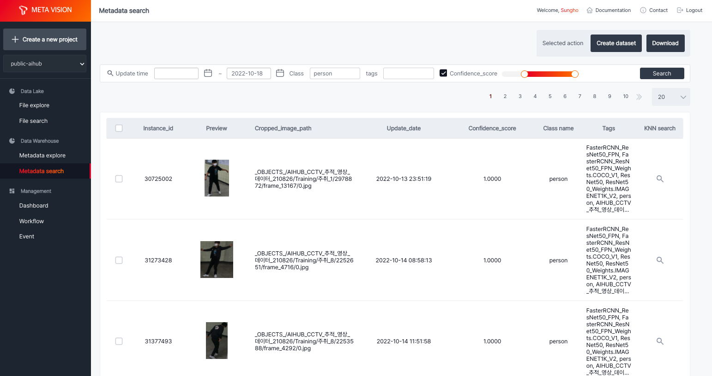
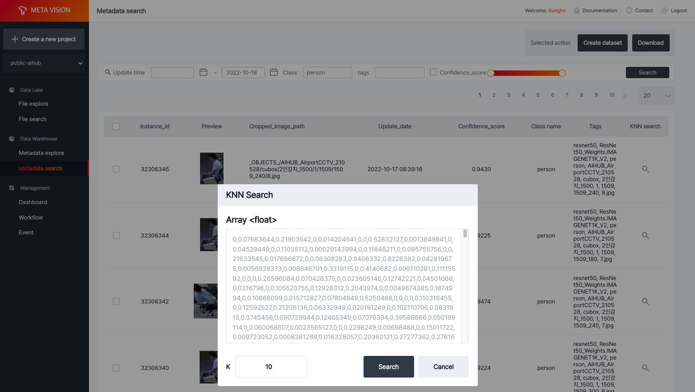
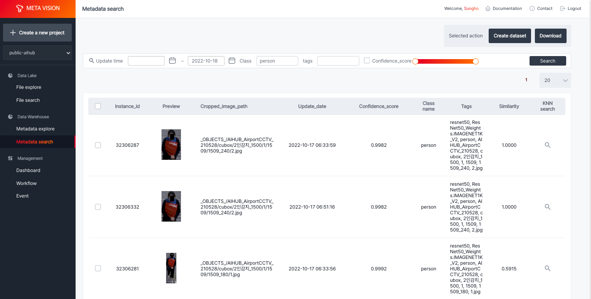

# Metadata explore

<b>Metadata explore</b>는 object storage에 있는 데이터에 대해 ML Workflow를 수행한 결과를 File browser 형태로 제공합니다.

<b>datasets</b>에는 기본 dataset(프로젝트 이름과 동일)이 제공되어 ML Workflow를 통해 추출된 파일 및 객체에 대한 메타 정보가 저장됩니다.

<b>< Metadata explore 조회 ></b>

그 외에 <b>create dataset</b> 기능을 사용하여, 검색을 통해 수집한 파일들을 별도의 dataset으로 저장하여 관리할 수 있습니다.

<b>< 신규 dataset 생성 ></b>

# Metadata search

ML Workflow를 통해 추출된 메타 정보는 LightningDB에 저장되는데, 추출된 각 객체는 update_date, class, tags, confidence_score 등의 정보를 가지고 있어 이를 기반한 조회를 제공합니다.

<b>< Metadata search 조회 결과 ></b>

각 객체는 feature extraction 모델을 사용하여 객체에 대한 feature 정보를 추출하고 저장하고 있습니다. 

<b>KNN search</b> 기능을 사용하면, 선택한 이미지와 유사한 이미지를 검색할 수 있습니다.

<b>< KNN search 조회 ></b>

<b>< KNN search 조회 결과 ></b>

