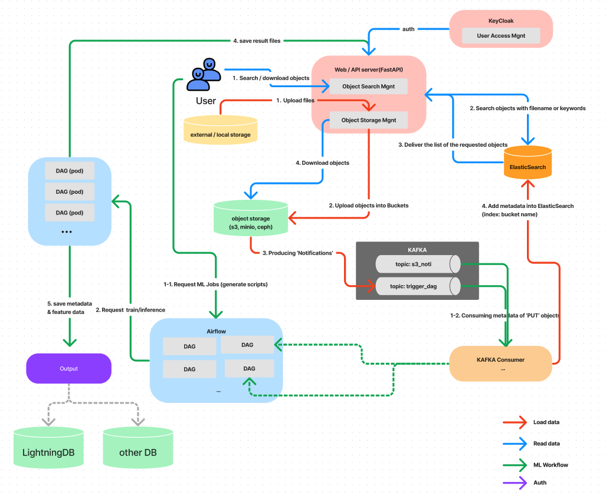

# 1. MetaVision2 is ...

MetaVision2는 대용량의 Vision Data를 효율적으로 관리하고 관련 응용 서비스를 쉽게 사용할 수 있는 환경을 제공하는 플랫폼입니다.

- 기존에 관리되지 않고 있는 데이터에 대한 관리 커버리지 및 재활용성을 제고
- CVPaaS Cloud 서비스에서의 확장성 있고, 비용 효율적인 AI Ops 서비스의 기반을 제공
- Golden Data Discovery & AI 모델 개선 Cycle 완성을 위한 환경 제공

# 2. Architecture

MetaVision2의 모든 서비스는 Kubernetes 환경에서 동작하고 있습니다.

AWS S3와 호환되는 Ceph를 사용하여 object storage를 구성하였고, Apache KAFKA, ElasticSearch 등을 사용하여 object storage에 업로드한 파일들에 대한 메타데이터를 관리하고 있습니다.

Apache Airflow 및 자체 개발한 ML Workflow 서비스를 사용하여 보유한 데이터에 대해 데이터 가공 및 Machine Learning(ML) inference 작업을 수행할 수 있습니다.

ML inference의 결과는 자체 개발한 LightningDB에 저장되어 메타데이터 기반으로 지연없는 데이터 검색 및 객체로부터 추출한 feature value 기반으로 유사 이미지 검색을 지원하고 있습니다.

<b>< MetaVision2 Architecture ></b>

# 3. Features

- AWS S3와 호환되는 object storage인 <b>Ceph</b> 제공 및 확장가능한 스토리지 제공
- 사용자 인증 및 이를 기반으로 사용자별 데이터 접근 권한 관리 및 공유 기능 제공
- Object storage에 저장된 모든 파일에 대해 <b>키워드 검색</b> 지원
- Object storage에 저장된 미디어 파일에 대한 <b>썸네일 제공</b>
- ML inference를 위한 기본 ML Workflow 이미지(Motion Detection/Object Detection/Feature Extraction) 제공
- 다양한 model 사용 및 데이터 처리 그리고 inference 코드를 운영할 수 있는 ML Workflow Image Repository 운영(사용자가 이미지를 생성하여 업로드한 후 사용 가능)
- Object storage에 업로드한 파일에 대해 자동으로 ML Workflow를 수행할 수 있는 Event 등록 서비스 제공
- ML Inference를 통해 추출한 메타데이터를 효율적으로 관리하기 위한 LightningDB 사용(데이터 조회 및 유사 이미지 검색 지원)
- 프로젝트별 데이터 현황을 모니터링할 수 있는 대시보드 제공