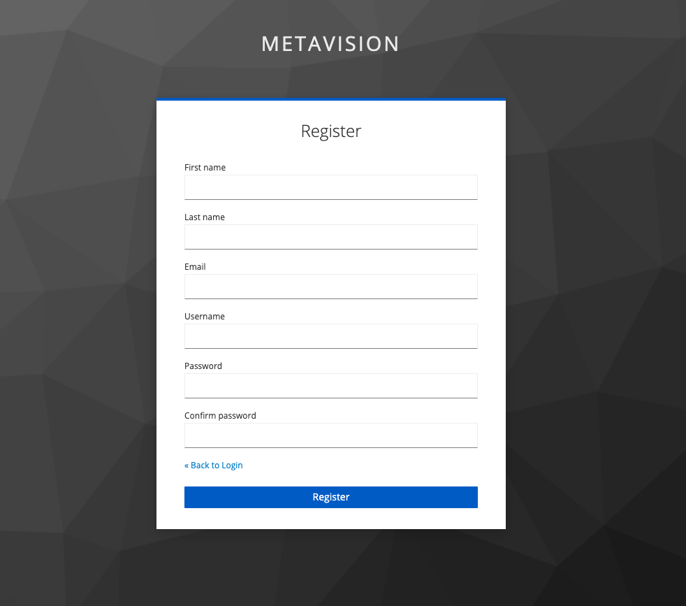

# Register & Sign in

MetaVision2의 모든 데이터는 프로젝트별로 접근 권한이 관리되며, 해당 프로젝트에 사용자를 추가 및 삭제를 함으로써 데이터에 대한 접근을 제한합니다.

최초 사용 시 <b>Sign in</b> 화면에서 'register'를 선택하여 사용자를 등록할 수 있습니다.

<b>< 사용자 등록 ></b>

사용자 등록 후 로그인 하여 프로젝트 생성 및 공유받은 데이터를 확인할 수 있습니다.

<b>< 로그인 ></b>
