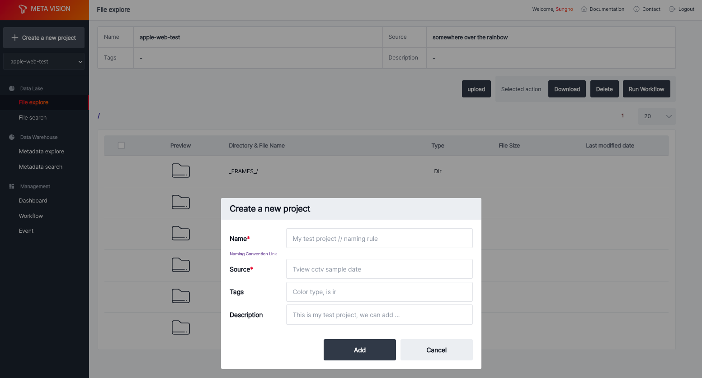

# Create Project

로그인 후 프로젝트 생성을 통해 object storage에 저장 공간을 생성할 수 있습니다.

좌측 상단 <b>Create a new project</b> 를 통해 신규 프로젝트를 생성할 수 있습니다.

<b>< 프로젝트 생성 ></b>

사용 가능한 프로젝트는 <b>Create a new project</b> 버튼 아래를 선택하여 목록을 확인할 수 있습니다.

<b>< 프로젝트 목록 및 선택 ></b>
