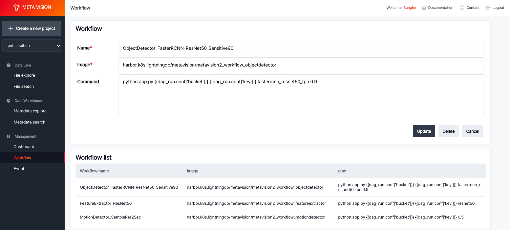
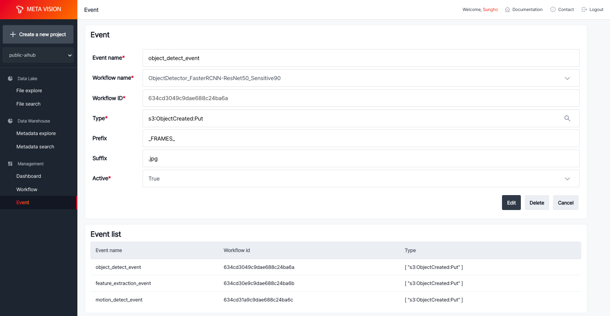
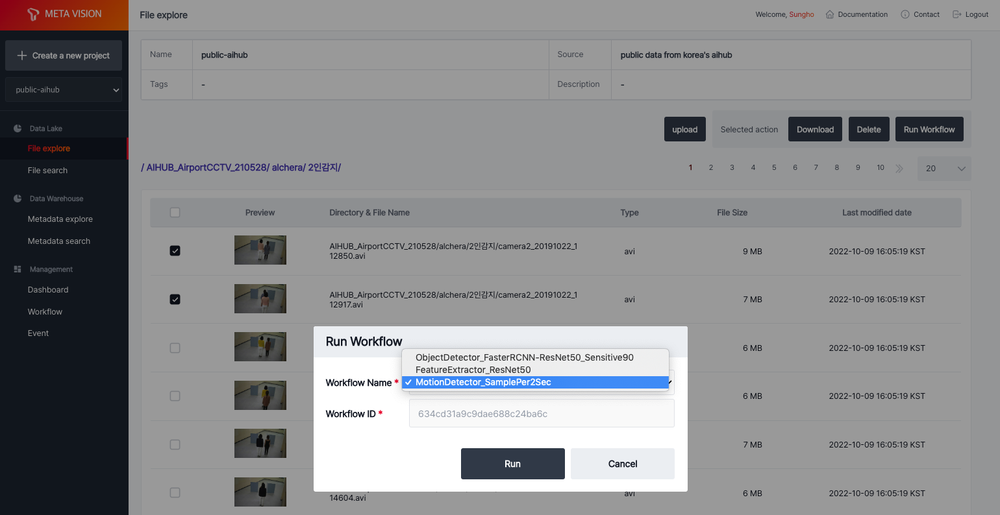

# Workflow

<b>Workflow</b>는 ML inference를 수행할 코드를 Docker 이미지로 생성하고 등록하여, 이후 등록한 event에 의해 실행할 수 있도록 합니다.

ML Workflow에 사용할 이미지 생성방법은 다음과 같습니다.

- 데이터 가공 및 ML 수행 코드 작성
- Docker 이미지로 빌드
- 빌드한 이미지를 가지고 Workflow 등록

<b>< Workflow 등록 ></b>

# Event

<b>Event</b>는 등록한 Workflow를 수행할 조건을 추가하여 원하는 파일에 대해 Workflow를 수행할 수 있도록 합니다.

Object storage에 업로드하는 파일의 'Prefix'(파일 경로)와 'Suffix'(확장자) 정보를 이용하여 조건을 생성할 수 있습니다.

<b>< Event 등록 ></b>

# Run Workflow

등록한 Event를 이용한 방법 외에도, 이미 보유한 파일에 대해 선택적으로 등록한 Workflow를 수행할 수 있습니다.

File explore에서 파일 선택 후 'Run workflow'를 선택하고 원하는 Workflow 이미지를 선택하면 됩니다.

<b>< 선택한 파일에 대해 Workflow 실행 ></b>
